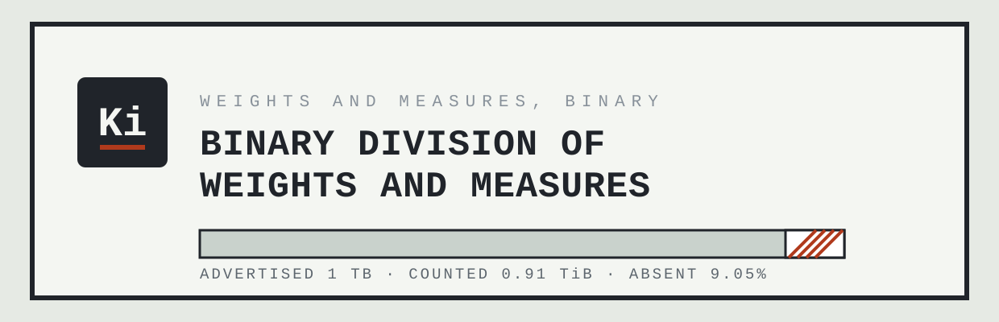

<p align="center">
  
</p>

<p align="center">
  <strong>Weights and measures, binary.</strong><br>
  Advertised 1 TB &middot; Counted 0.91 TiB &middot; Absent from the label: 9.05%
</p>

---

This repository contains the public site for the Binary Division of
Weights and Measures (binary.besteffortindustries.com), which measures the
gap between the byte as sold and the byte as counted, and declines to
close it.

## The measurement

A drive is sold in powers of ten and counted in powers of two. The
manufacturer ships 10<sup>12</sup> bytes and calls it a terabyte, which is
what the SI prefix has always meant. The computer divides by 2<sup>40</sup>,
gets 0.91, and prints the letters TB anyway, which is what it has always
done. Both readings are correct, the hardware is intact, the arithmetic is
sound, and 9.05% of the number is not there.

The Division measures this to two decimal places and issues no
recommendation.

## What the site actually does

Everything runs client-side and every figure on the page is real:

* **The instrument** takes an advertised capacity in TB or GB and draws it
  as a dimensioned bar: the full length as sold, the counted length
  underneath, and the difference hatched. The drawing is redrawn at the
  page's own pixel size, so the labels are never scaled and the sheet
  never scrolls sideways.
* **The notes** are matters of record. IEC 80000-13 defined the kibibyte
  and its relatives in 1998 for exactly this reason. A single machine
  measures memory in powers of two, storage in powers of ten, and network
  throughput in decimal bits. Suits were brought in the United States
  against drive manufacturers over this arithmetic and were settled; no
  storage was created.
* **Detail A** is the 3.5-inch diskette, whose 1.44 MB is neither decimal
  nor binary: its true capacity is 1,440 KiB, which the industry divided
  by 1,000 to reach the number on the label. The Division has classified
  that megabyte as a unit of history and declines to calibrate against it.

---

## Development notes

The parody ends here. The rest of this file is accurate.

### Layout

A static, zero-build, zero-dependency site. Two HTML files and a handful
of generated images. There is no framework, no bundler and no
`package.json`. Cloudflare Pages serves the repository root exactly as it
appears here.

```
index.html            the site, drawing and instrument included
404.html              catch-all, served automatically by Cloudflare Pages
favicon.svg           icon, generated from tools/favicon-src.svg with text outlined
favicon.ico           16/32/48, generated
apple-touch-icon.png  180x180, generated
og.png                1200x630 share image, generated
assets/logo.svg       wordmark, text outlined, used at the top of this README
tools/og.html         source for og.png
tools/logo-src.svg    source for assets/logo.svg, text still live
tools/favicon-src.svg source for favicon.svg, text still live
tools/favicon-16.svg  pixel-grid 16px icon, used for the smallest .ico entry
Makefile              asset regeneration only, never runs at deploy time
_headers              Cloudflare Pages header rules
robots.txt            permissive
wrangler.toml         Cloudflare Pages configuration
mise.toml             pins the Wrangler version used to deploy
```

The page makes zero requests to any external domain. The site is set in
the system monospace stack throughout, because it is a drawing and a
drawing is lettered; the prose paragraphs drop to the system sans so the
reading passages do not fight the dimensions.

## The design

The site is a single engineering drawing sheet: a field strip across the
top, the title block at the bottom, numbered notes, a parts callout, and
the instrument itself in the middle. The mark is `Ki`, the binary prefix,
ruled underneath in the colour the drawing reserves for what is missing.

Two decisions worth keeping:

* **The drawing sizes itself in real pixels.** `draw()` reads the SVG's own
  rendered width and sets a matching `viewBox`, so one user unit is one
  device-independent pixel and the labels render at their true size. Below
  560px it drops to four scale divisions and shorter labels rather than
  shrinking the type. Nothing is in an `overflow-x` container, because
  nothing overflows.
* **The shortfall has no callout.** The hatched zone shows it, the two
  dimension lines bracket it, and the readout underneath states it in
  bytes, TiB, TB and percent. A fifth statement of the same number was
  landing on top of the upper dimension label on a phone.

### The production domain

The Division has no domain of its own, so its canonical host is a
subdomain of the parent: `binary.besteffortindustries.com`. That is the
host every absolute URL on the page points at, so link previews resolve.
If the site is ever promoted to a domain of its own, the canonical host
changes in the places below and nothing else derives it:

| File | What to change |
| --- | --- |
| `index.html` | `rel=canonical`, `og:url`, `og:image`, `twitter:image` |
| `404.html` | nothing, the 404 uses only root-relative paths |
| `tools/og.html` | the domain printed in the footer of the share image |
| `README.md` | this table, and the mentions above it |

After changing `tools/og.html`, re-run `make og`.

### Local preview

```sh
make serve          # python3 -m http.server 8000
```

Then open `http://localhost:8000`. A local server is preferable to opening
the file directly because the icon paths are root-absolute.

### Regenerating images

Only needed when the wordmark, the icon or the share image changes.
Requires `google-chrome`, ImageMagick 7 (`magick`) and Inkscape on the
machine doing the regenerating; none of them is needed to deploy, because
the outputs are committed. Courier New resolves through fontconfig to
Liberation Mono, which is metric-compatible, so the rendered assets match
what most non-Apple visitors see in the browser.

```sh
make assets         # everything below
make og             # og.png     <- tools/og.html, via headless Chrome
make favicon        # favicon.svg (outlined) + favicon.ico + apple-touch-icon.png
make logo           # assets/logo.svg <- tools/logo-src.svg, text outlined
```

`make favicon` and `make logo` outline their text so the icon and the
wordmark render the same whether or not the viewer has a monospace face.
Inkscape rewrites the whole file, so the `GENERATED` comment at the top
has to be pasted back afterwards.

### Deploying

Wrangler is configured via `wrangler.toml`, so a deploy is one command
from an authenticated shell:

```sh
make deploy         # wrangler pages deploy .
```

The Wrangler version is pinned by `mise.toml` (this machine manages its
Wrangler through [mise](https://mise.jdx.dev/); the global config tracks
`latest`, the repo pins an exact version). To move the pin, edit
`mise.toml`, run `mise install`, and deploy once to confirm nothing moved
underneath.

### Which Cloudflare account this deploys to

This machine has two Cloudflare identities, and picking the wrong one
deploys this site into an unrelated organisation.

**Pages configuration cannot pin the account.** `account_id` is a
Workers-only key; putting it in a Pages `wrangler.toml` makes Wrangler
refuse to run. So the account is selected by **an auth profile bound to
this directory**, recorded in
`~/.config/.wrangler/profiles/directory-bindings.json`:

```sh
wrangler auth activate personal    # already done; re-run after moving the repo
wrangler whoami                    # must print: Active profile: personal
```

Without a binding, Wrangler falls back to the `default` profile, which
here is the other organisation, and it will deploy there without asking.
**Check `whoami` before deploying.** The binding lives outside the repo,
so a fresh clone, a moved directory, or another machine all need
`wrangler auth activate` again.

One extra trap: Wrangler caches the resolved account in the untracked
`.wrangler/cache/wrangler-account.json` inside this directory. If a deploy
ever went to the wrong account from here, activating the right profile is
**not** enough; delete `.wrangler/` as well, or the cached account ID wins
and the API call fails with `Authentication error [code: 10000]`.

For CI, where profiles do not exist, set `CLOUDFLARE_ACCOUNT_ID` (the
account to deploy into) and `CLOUDFLARE_API_TOKEN` (credentials scoped to
it) as environment variables.

The Pages project is `binaryweights`, production branch `main`, with no
build command and the build output directory set to `/`. If you ever
recreate it from the dashboard, use exactly those values; there is
nothing to build, and any build command entered there will only make the
deployment worse.

To wire the Git integration instead, connect the
`holthe/binary-weights-and-measures` repository under **Workers & Pages ->
Create -> Pages -> Connect to Git** with the same settings. Note that the
repository name is hyphenated and the Pages project name is not.

### Custom domain

Deploy at least once first, so the project exists. Then, in the dashboard
under **Workers & Pages** -> `binaryweights` -> **Custom domains** -> **Set
up a custom domain**, add `binary.besteffortindustries.com`. The zone is
already on Cloudflare, so the CNAME is created for you; do not create the
record by hand first, because a pre-existing record blocks the flow.
Universal SSL already covers one level of subdomain on that zone, so the
certificate needs no extra step.

Until the domain is attached the site is reachable at
`binaryweights.pages.dev`.

### Related

The Division is a division of
[Best Effort Industries](https://besteffortindustries.com). The register
there is the only authority on division numbering, and this repository
deliberately records none: the site files itself as `BEI-BWM`, which is
derived from the Division's own name and cannot go stale when the
register renumbers.

## License

Parody. The prefixes are real, IEC 80000-13 is real, the 9.05% is
arithmetic, and the diskette really was measured in a unit that exists
nowhere else. The Division is the only party involved that never existed.
